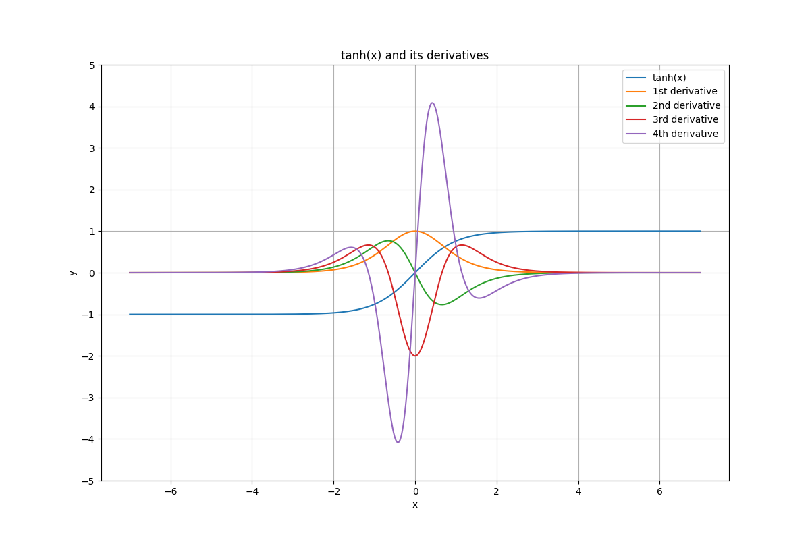
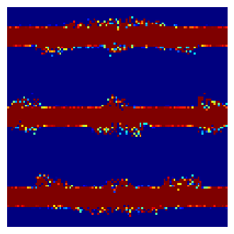

# Autograd  [](https://travis-ci.org/HIPS/autograd)

*Note to users:* We just merged a rewrite of autograd's core. If you need to
roll back the change, you can use `git checkout 0f026ab` and [open an
issue](https://github.com/hips/autograd/issues) to let us know about any
problems.

Autograd can automatically differentiate native Python and Numpy code. It can
handle a large subset of Python's features, including loops, ifs, recursion and
closures, and it can even take derivatives of derivatives of derivatives. It
uses reverse-mode differentiation (a.k.a. backpropagation), which means it can
efficiently take gradients of scalar-valued functions with respect to
array-valued arguments. The main intended application is gradient-based
optimization. For more information, check out the [tutorial](docs/tutorial.md)
and the [examples directory](examples/).

Example use:

```python
>>> import autograd.numpy as np  # Thinly-wrapped numpy
>>> from autograd import grad    # The only autograd function you may ever need
>>>
>>> def tanh(x):                 # Define a function
...     y = np.exp(-x)
...     return (1.0 - y) / (1.0 + y)
...
>>> grad_tanh = grad(tanh)       # Obtain its gradient function
>>> grad_tanh(1.0)               # Evaluate the gradient at x = 1.0
0.39322386648296376
>>> (tanh(1.0001) - tanh(0.9999)) / 0.0002  # Compare to finite differences
0.39322386636453377
```

We can continue to differentiate as many times as we like:

```python
>>> def elementwise_grad(fun):                   # A wrapper for broadcasting
...     return grad(lambda x: np.sum(fun(x)))    # (closures are no problem)
...
>>> grad_tanh   = elementwise_grad(tanh)
>>> grad_tanh_2 = elementwise_grad(grad_tanh)    # 2nd derivative
>>> grad_tanh_3 = elementwise_grad(grad_tanh_2)  # 3rd derivative
>>> grad_tanh_4 = elementwise_grad(grad_tanh_3)  # etc.
>>> grad_tanh_5 = elementwise_grad(grad_tanh_4)
>>> grad_tanh_6 = elementwise_grad(grad_tanh_5)
>>>
>>> import matplotlib.pyplot as plt
>>> x = np.linspace(-7, 7, 200)
>>> plt.plot(x, tanh(x),
...          x, grad_tanh(x),
...          x, grad_tanh_2(x),
...          x, grad_tanh_3(x),
...          x, grad_tanh_4(x),
...          x, grad_tanh_5(x),
...          x, grad_tanh_6(x))
>>> plt.show()
```



See the [tanh example file](examples/tanh.py) for the code.

## Documentation

You can find a tutorial [here.](docs/tutorial.md)

## End-to-end examples

* [Simple neural net](examples/neural_net.py)
* [Convolutional neural net](examples/convnet.py)
* [Recurrent neural net](examples/rnn.py)
* [LSTM](examples/lstm.py)
* [Neural Turing Machine](https://github.com/DoctorTeeth/diffmem/blob/512aadeefd6dbafc1bdd253a64b6be192a435dc3/ntm/ntm.py)
* [Backpropagating through a fluid simulation](examples/fluidsim/fluidsim.py)



* [Variational inference in Bayesian neural network](examples/bayesian_neural_net.py)
* [Gaussian process regression](examples/gaussian_process.py)
* [Sampyl, a pure Python MCMC package with HMC and NUTS](https://github.com/mcleonard/sampyl)

## How to install

Just run `pip install autograd`

## Authors

Autograd was written by [Dougal Maclaurin](https://dougalmaclaurin.com),
[David Duvenaud](https://www.cs.toronto.edu/~duvenaud/)
and [Matt Johnson](http://people.csail.mit.edu/mattjj/),
and we're actively
developing it. Please feel free to submit any bugs or feature requests.
We'd also love to hear about your experiences with autograd in general.
Drop us an email!

We want to thank Jasper Snoek and the rest of the HIPS group (led by Prof. Ryan
P. Adams) for helpful contributions and advice; Barak Pearlmutter for
foundational work on automatic differentiation and for guidance on our
implementation; and Analog Devices Inc. (Lyric Labs) and Samsung Advanced Institute
of Technology for their generous support.
